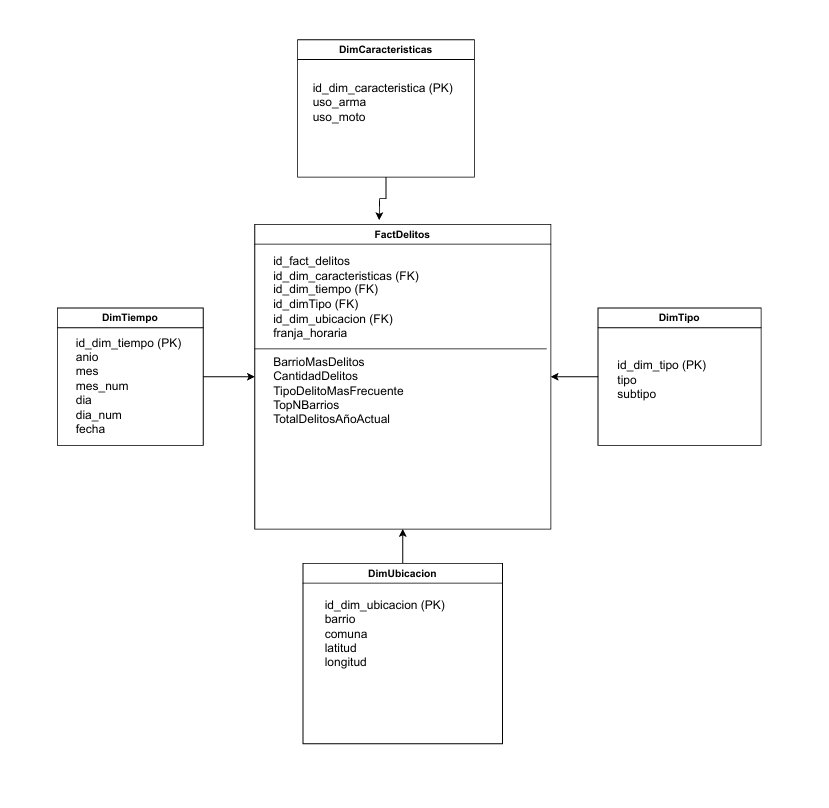
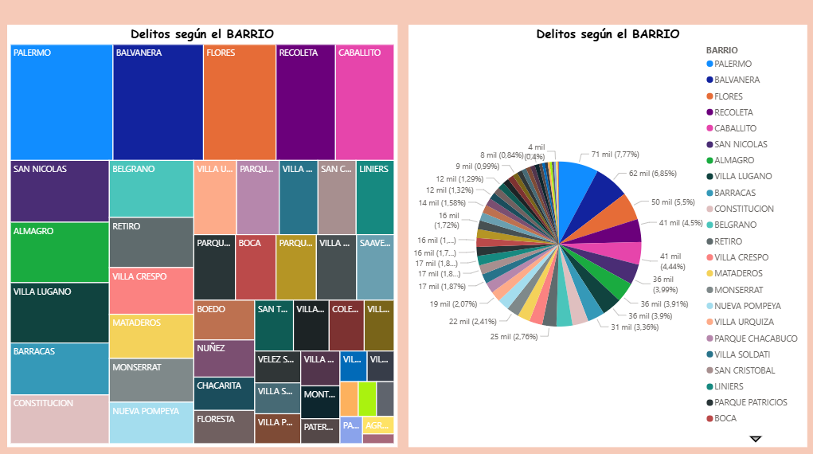
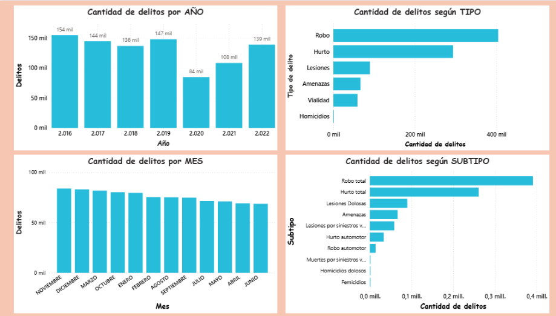
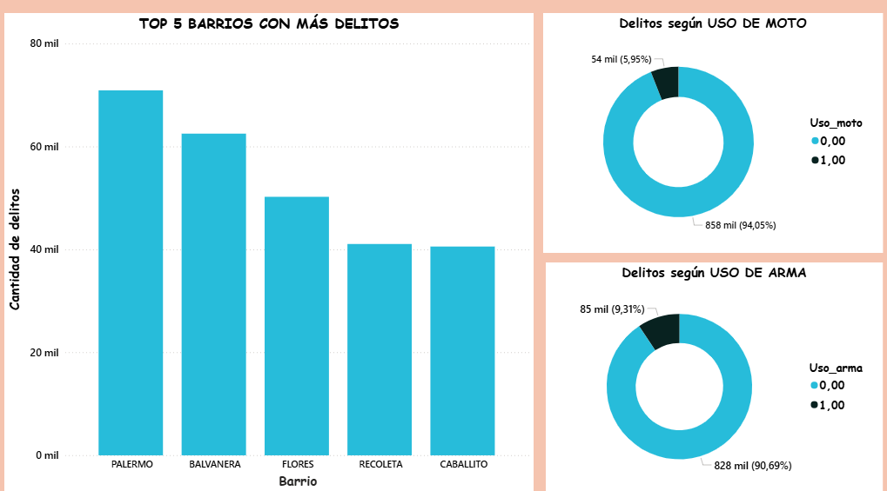
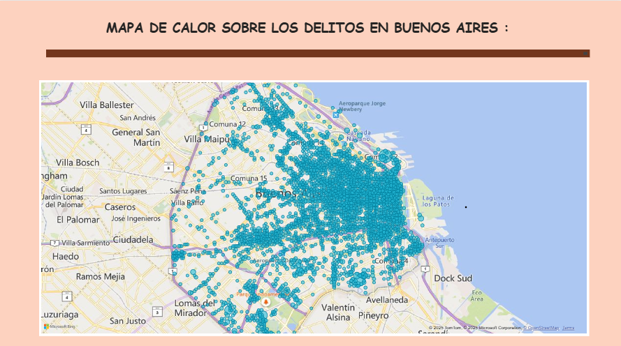
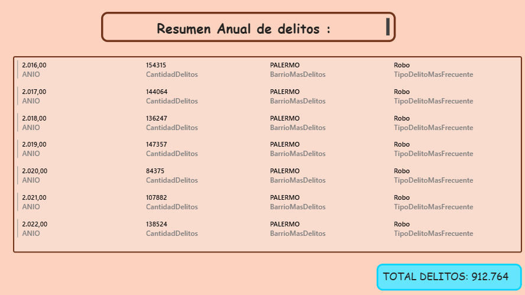

# Data-WareHouse-Delitos-Buenos-Aires

Proyecto de creación de un **Data Warehouse** sobre delitos en la ciudad de Buenos Aires, consolidando información de diferentes fuentes para facilitar el análisis y la visualización de los datos, convirtiéndolos en **insights** de valor para la toma de decisiones.

## Objetivo
El objetivo de este proyecto es poder consolidar y organizar los datos de delitos en Buenos Aires para **analizarlos de manera efectiva**, detectar patrones y tendencias, generar **información útil y visualizaciones claras**, y así apoyar la **toma de decisiones basada en datos**..

## Herramientas
Para el desarrollo de este proyecto se utilizaron las siguientes herramientas:

- **SQL / PL-SQL** → Para el proceso ETL y creación del Modelo Multidimensional.
- **Power BI** → para la visualización y creación de dashboards interactivos.  
- **Archivos CSV** → como fuente de datos inicial para cargar la información en el Data Warehouse.  
- **GitHub** → Para la gestion de almacenamiento del proyecto.
- **Draw.io** →  Para el diseño del Modelo multidimensional.

## Datos
Los datos recolectados para este proyecto corresponden a los delitos ocurridos en Buenos Aires, Argentina, desde el año 2016 hasta el 2022 (inclusive), dando un total de **939.684 registros iniciales**.  

Luego del proceso ETL, en el que se eliminó una columna (CANTIDAD) que no aportaba valor al análisis, se estandarizaron y normalizaron los datos, se eliminaron duplicados, valores nulos y caracteres erróneos.  

La base de datos final está compuesta por **912.764 registros**.

## Modelo multidimensional

En base al siguiente modelo multidimensional, se crearon las respectivas **dimensiones** y la **tabla de hechos** para cargar los datos ya transformados.

Para la creación del modelo multidimensional se deteminaron las dimensiones: 
  -DimCaracteristica 
  -DimTiempo
  -DimTipo
  -DimUbicacion

Tabla de hechos:
  -FactDelitos

## POWER BI: 

Finalmente, realice la conexión con Power bi para generar los siguientes Dashboards:

## ¿En base a los graficos obtenidos, que interpretamos? 

Los dashboards generados en Power BI nos permiten **interpretar rápidamente los datos de delitos en Buenos Aires**, destacando aspectos como:

- Los **barrios con mayor cantidad de delitos**.  
- Las **tendencias de delitos según el año**, por ejemplo, durante la pandemia se registró la menor cantidad de delitos.  
- La **variación de delitos por estación**; por ejemplo, se observa que en invierno (meses de abril, mayo, junio y julio) los delitos disminuyen comparando con las otras estaciones del año.  
- Los **tipos de delitos más frecuentes** y su comparación con otros tipos, visualizados claramente en gráficos de barras.  
- Los **top 5 barrios** con más delitos registrados.  
- El **mapa de calor** permite identificar las zonas con mayor concentración de delitos; las áreas más “punteadas” o con más intensidad representan los barrios con más delitos.

  ### ¿Qué hacer con estos datos?

La información obtenida de los dashboards nos permite:

- Tomar decisiones basadas en datos para la **planificación de políticas de seguridad**, identificando qué zonas priorizar en cuanto a personal, medidas de prevención y monitoreo.  
- Evaluar estrategias para reducir la tendencia de delitos y entender cómo factores externos, como la pandemia, pueden afectar la cantidad de delitos. También permite analizar fechas clave para detectar **patrones o eventos que influyan en los delitos** y en base a eso, poder anticiparnos a futuras situacioes.  
- El sector de seguridad puede diseñar estrategias específicas para los **top 5 barrios con más delitos**, identificando franjas horarias críticas, días de la semana, ubicaciones y meses con mayor incidencia, y así tomar acciones preventivas más efectivas, contribuyendo a **mejorar la seguridad en la ciudad de Buenos Aires** y generando un impacto positivo en la vida de las personas.

